<!-- TOC -->

- [AngularMaterialPractice](#angularmaterialpractice)
    - [Code Scaffolding](#code-scaffolding)
        - [Development server](#development-server)
        - [Code scaffolding](#code-scaffolding)
        - [Build](#build)
        - [Running unit tests](#running-unit-tests)
        - [Running end-to-end tests](#running-end-to-end-tests)
        - [Further help](#further-help)
    - [Angular Material Design](#angular-material-design)
    - [Angular CDK (Component Development Kit)](#angular-cdk-component-development-kit)
    - [Configure application to use angular material](#configure-application-to-use-angular-material)
    - [Install and import hammerjs](#install-and-import-hammerjs)
    - [Setup and use material icons](#setup-and-use-material-icons)

<!-- /TOC -->

# AngularMaterialPractice

This project was generated with [Angular CLI](https://github.com/angular/angular-cli) version 6.0.7.

## Code Scaffolding

### Development server

Run `ng serve` for a dev server. Navigate to `http://localhost:4200/`. The app will automatically reload if you change any of the source files.

### Code scaffolding

Run `ng generate component component-name` to generate a new component. You can also use `ng generate directive|pipe|service|class|guard|interface|enum|module`.

### Build

Run `ng build` to build the project. The build artifacts will be stored in the `dist/` directory. Use the `--prod` flag for a production build.

### Running unit tests

Run `ng test` to execute the unit tests via [Karma](https://karma-runner.github.io).

### Running end-to-end tests

Run `ng e2e` to execute the end-to-end tests via [Protractor](http://www.protractortest.org/).

### Further help

To get more help on the Angular CLI use `ng help` or go check out the [Angular CLI README](https://github.com/angular/angular-cli/blob/master/README.md).

## Angular Material Design

>Material is both a UI Component framework and a reference implementation of Google's Material Design Specification

## Angular CDK (Component Development Kit)
 
> Set of reusable building blocks for component development. These reusable building blocks implements Material Design specifications

## Configure application to use angular material

* Install `**@angular/material**` and `**@angular/cdk**`

  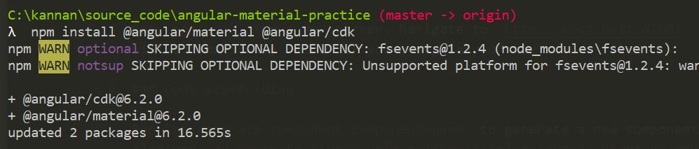

* Install `**@angular/animations**`

  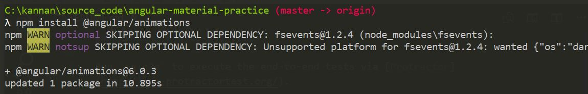

* Import animations module into app module

   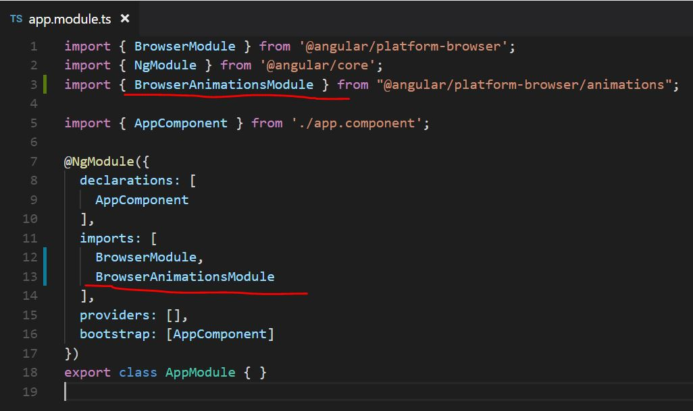

* Generate material module which imports required material modules and export at once and works as proxy module

  

  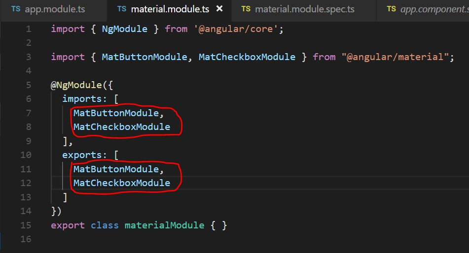

  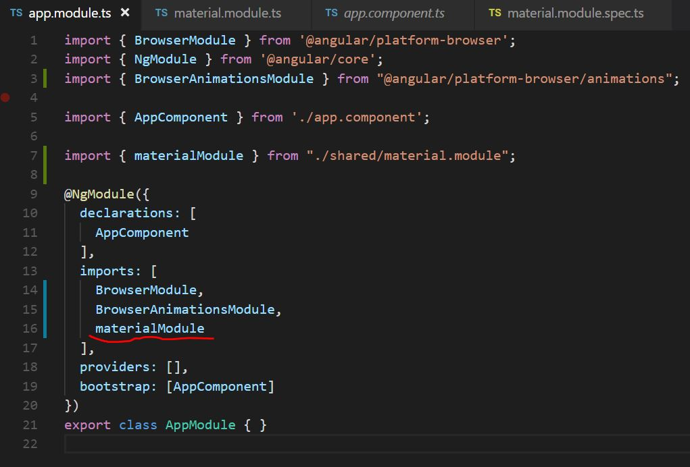

* To get material design components look good we need to import one of the pre bulit themes from `@angular/material/prebuilt-themese` inot global styles.css file

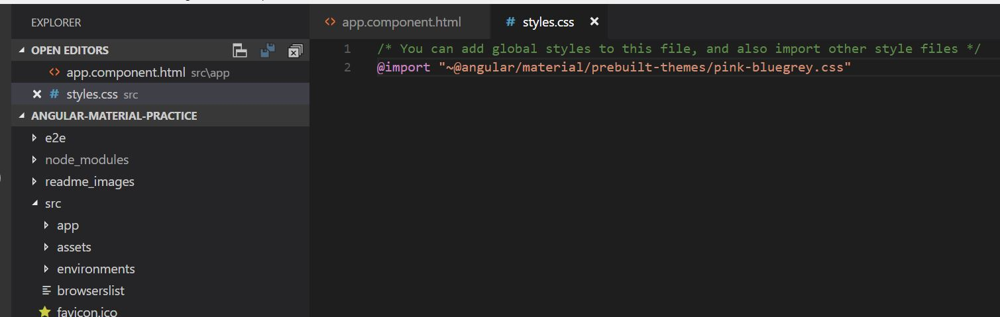

  ## Using angular material UI components
  >https://material.angular.io has sample and definitions about using different angular material UI components

## Install and import hammerjs

>Install and import hammerjs for gestur support in touch devices

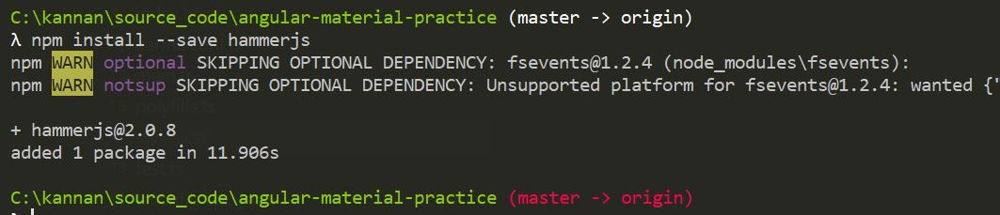

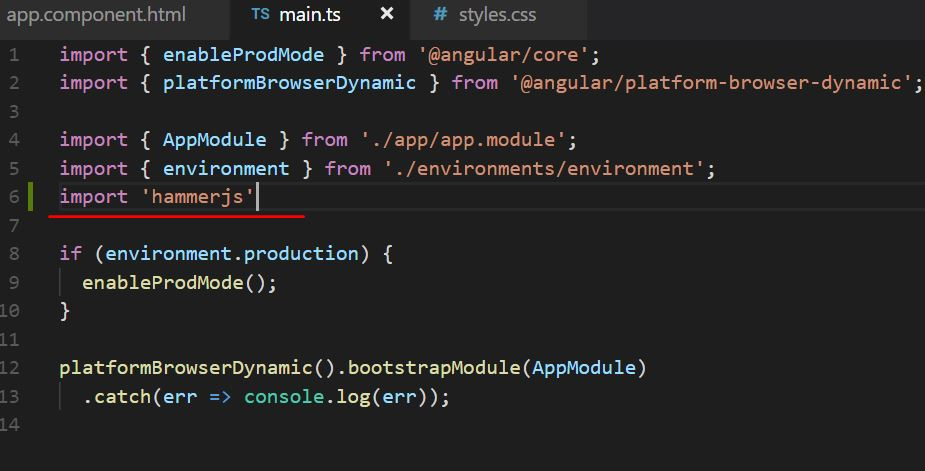

## Setup and use material icons

* Include font family for icons in index.html

  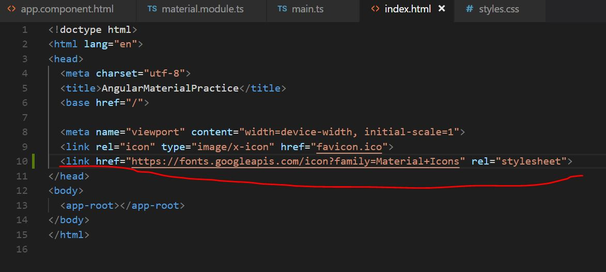

* Import `MatIconModule` into `appModule`

  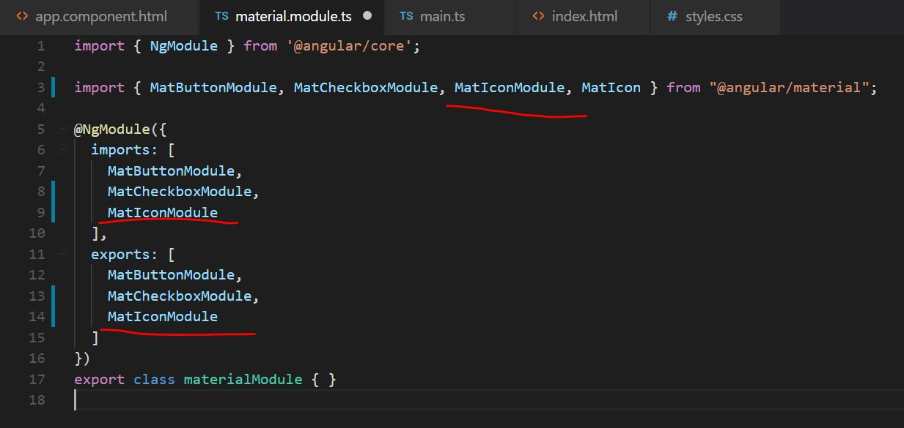

* Sample usage of icon

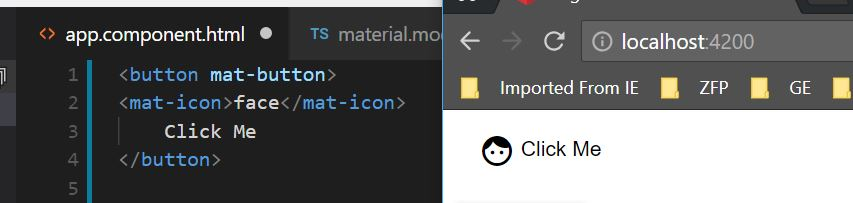

## Import all material moudles
> Following is the link of all material moudles
https://github.com/ajtowf/angularmaterial/blob/master/src/app/shared/material.module.ts

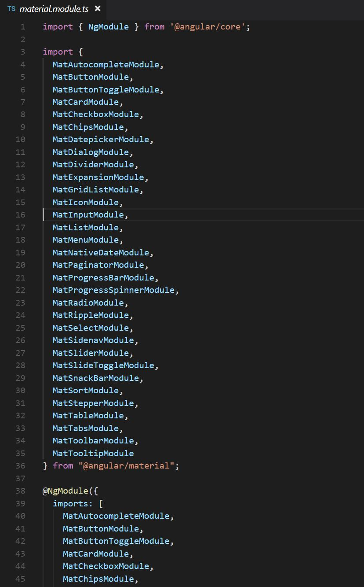